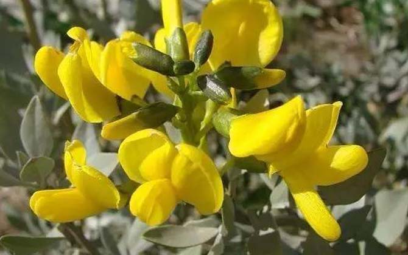
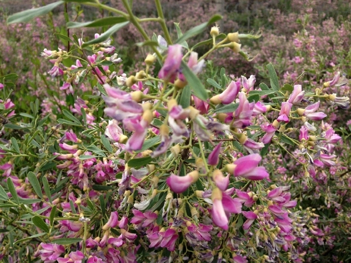
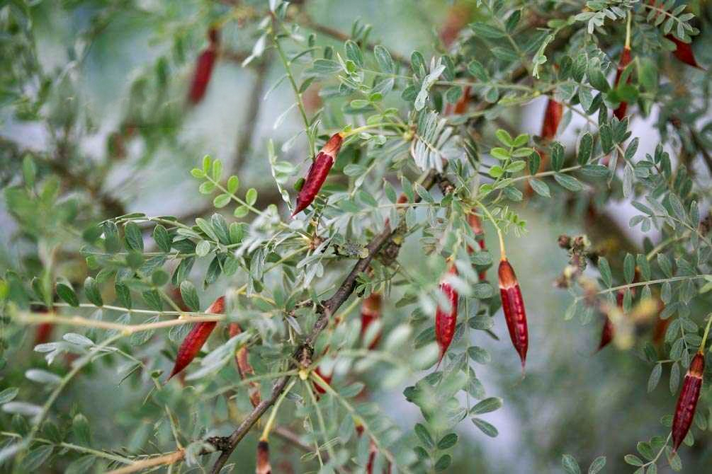

# 沙生植物

中国西北地区，甘肃民勤县的沙生植物，根据《民勤县志》（1986-2005）中展示的植物，汇总整理。

每个标题都链接到百科详细介绍，点击查看。

## [沙拐枣（Calligonum mongolicum Turcz.）](https://baike.baidu.com/item/沙拐枣/1813727) ▼

## [白刺（酸胖、Nitraria tangutorum Bobrov）](https://baike.baidu.com/item/白刺/24160392) ▼

00:20

## [沙葱（蒙古韭、蒙古葱、Allium mongolicum Regel）](https://baike.baidu.com/item/蒙古韭) ▼

## [梭梭（Haloxylon ammodendron (C. A. Mey.) Bunge）](https://baike.baidu.com/item/梭梭) ▼

## [沙米（沙蓬、Agriophyllum squarrosum (L.) Moq.）](https://baike.baidu.com/item/沙蓬/9769303) ▼

## [黑果枸杞（Lycium ruthenicum Murray）](https://baike.baidu.com/item/黑果枸杞/9678364) ▼

## [沙冬青（Ammopiptanthus mongolicus (Maxim. ex Kom.) Cheng f.）](https://baike.baidu.com/item/沙冬青/1815248) ▼

## [红柳（多枝怪柳、Tamarix ramosissima Ledeb.）](https://baike.baidu.com/item/多枝柽柳) ▼

## [绵刺（Potaninia mongolica Maxim.）](https://baike.baidu.com/item/绵刺) ▼

## [沙鞭（沙竹、Psammochloa villosa (Trin.) Bor）](https://baike.baidu.com/item/沙鞭) ▼

## [黄花矶松（黄花补血草、Limonium aureum (L.) Hill）](https://baike.baidu.com/item/黄花补血草/4847214) ▼

00:18

## [锁阳（Cynomorium songaricum Rupr.）](https://baike.baidu.com/item/锁阳/329873) ▼

## [铃铛刺（Caragana halodendron (Pall.) Dum. Cours.）](https://baike.baidu.com/item/铃铛刺)▼

## [马蔺（马兰、马莲、Iris lactea Pall.）](https://baike.baidu.com/item/马蔺/2776595) ▼

## [麻黄（Ephedra sinica Stapf）](https://baike.baidu.com/item/麻黄/523096) ▼

## [花棒（细枝岩黄耆、Corethrodendron scoparium Fisch. et Basiner）](https://baike.baidu.com/item/细枝岩黄耆) ▼

## [毛条（拧条锦鸡儿、柠条、Caragana korshinskii Kom.）](https://baike.baidu.com/item/拧条锦鸡儿) ▼

## [红砂（Reaumuria songarica (Pall.) Maxim.）](https://baike.baidu.com/item/红砂/16129897) ▼

## [枸杞（Lycium chinense Miller）](https://baike.baidu.com/item/枸杞/272759) ▼

00:38

## [蓬柴草（蓬蓬草，白茎盐生草、Halogeton arachnoideus）](https://baike.baidu.com/item/蓬蓬草/6363750) ▼

多生长在砂地、干旱山坡及河滩，植株用火烧成灰后，可以取碱。风卷草说的也是它。

**蓬蓬草**植株用火烧成灰后，叫做蓬灰，可以取碱。

**蓬灰的用途**

蓬蓬草和西北人的生活息息相关，也是西北人的生命之草。用蓬蓬草烧制的[蓬灰](https://baike.baidu.com/item/蓬灰/5179021?fromModule=lemma_inlink)，是各种西北风味面食中不可或缺的一种辅助材料。风靡世界的[兰州牛肉拉面](https://baike.baidu.com/item/兰州牛肉拉面/2935423?fromModule=lemma_inlink)，除了面粉和制作工艺本身的独到之处外，其中一个最大的秘密，就在于和面的时候必须要使用蓬灰。

**天然蓬灰的制做**

以前秋天的时候，家家户户都要烧[蓬灰](https://baike.baidu.com/item/蓬灰/5179021?fromModule=lemma_inlink)。事先在地上挖个坑，把晒干的蓬蓬草不断地在坑里燃烧，蓬蓬草燃烧后剩下的草木灰，冷却后硬如石头，这就是蓬灰。使用前先用锤子砸碎，放在小坛子里用水泡上，取上面的清水使用。

早在十几年前，乡亲们已经不舍得用蓬灰做饭了，因蓬灰可卖钱，对于贫困地区人来说，这是一条致富挣钱门路。他们烧制的蓬灰都卖给了小贩子。随着工业食用碱到来，现在乡亲们基本上没有人烧蓬灰了。

参考：

[World Plants: Plant List](https://www.worldplants.de/world-plants-complete-list/complete-plant-list?tx_jaxonapi_test[distCode]=NKO&tx_jaxonapi_test[genusUid]=3112&tx_jaxonapi_test[speciesUid]=109094#plantUid-109094)

[Photos of Reaumuria songarica · iNaturalist United Kingdom]([Photos of Reaumuria songarica · iNaturalist United Kingdom](https://uk.inaturalist.org/taxa/928561-Reaumuria-songarica/browse_photos))

[Picture and description of Caragana korshinskii](https://www.esveld.nl/htmldiaen/c/cakors.htm)

Caragana korshinskii (Korshinsk Peashrub, Korshinsk Pea Shrub) – MySeedsCo https://www.myseeds.co/products/caragana-korshinskii-korshinsk-peashrub-korshinsk-pea-shrub?variant=41907749159105

[Reaumuria songarica - Image of an specimen - Plantarium](https://www.plantarium.ru/lang/en/page/image/id/104567.html)

[兰州市林业局 城市园林 【金城花语--一周一科普】No.13](https://lyj.lanzhou.gov.cn/art/2023/6/14/art_4352_1241868.html)

[植物活化石——绵刺_荒漠_繁殖_季节](https://www.sohu.com/a/507010176_121225982)

[Chinese Ephedra (Ephedra sinica)](https://www.inaturalist.org/taxa/135489-Ephedra-sinica)

[Halogeton (Halogeton arachnoideus) Flower, Leaf, Care, Uses - PictureThis](https://www.picturethisai.com/wiki/Halogeton_arachnoideus.html)

花棒冷知识，不屈不挠的“花坚强”：[百度百科](https://wapbaike.baidu.com/tashuo/browse/content?id=d4c4e5133c86d037e38f6b43)

文中若有错误之处，恳请大家不吝指正。谢谢。
