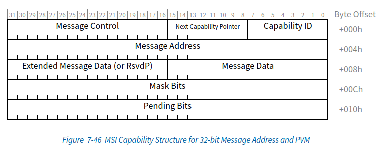
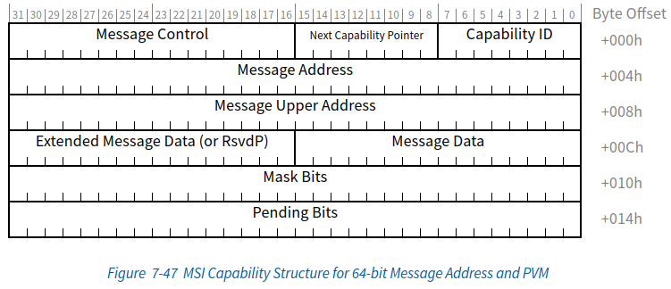
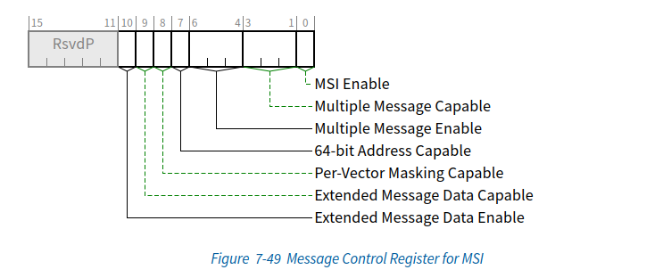
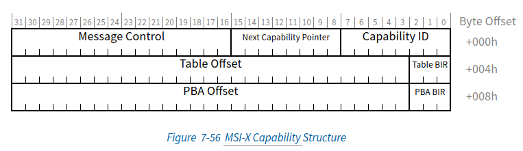
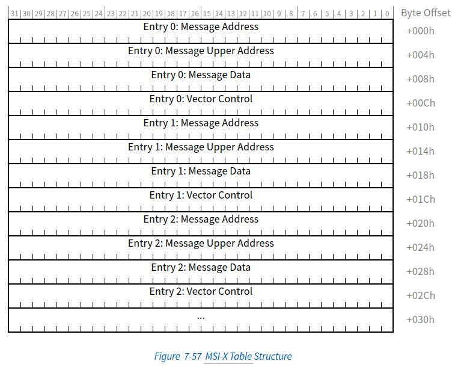
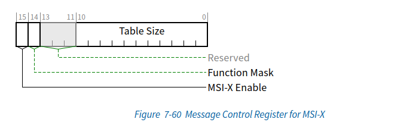
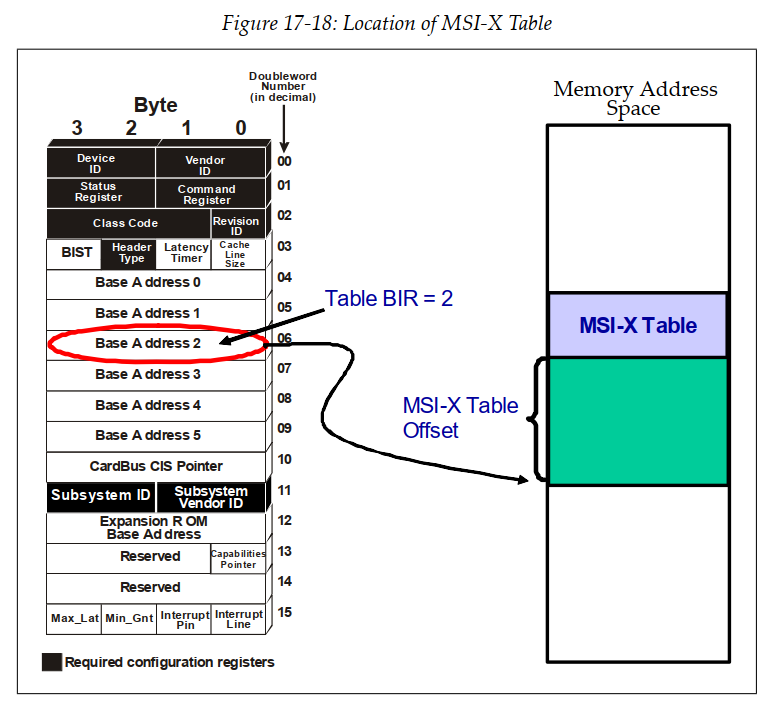
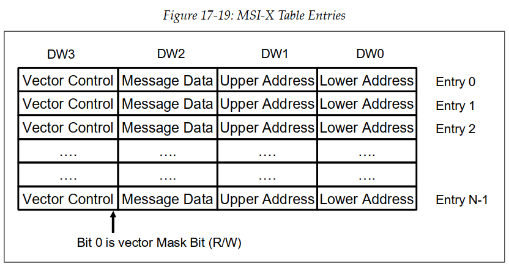

本文基于linux 5.7.0, 平台是arm64


转自：https://blog.csdn.net/yhb1047818384/article/details/106676560，并添加补充内容


### 1. MSI/MSI-X概述
PCIe有三种中断,分别为INTx中断，MSI中断，MSI-X中断，其中INTx是可选的，MSI/MSI-X是必须实现的。

#### 1.1 什么是MSI中断?

MSI， message signal interrupt, 是PCI设备通过写一个特定消息到特定地址，从而触发一个CPU中断。特定消息指的是PCIe总线中的Memory Write TLP, 特定地址一般存放在MSI capability中。

和传统的INTx中断相比，MSI中断有以下几个优点:
(1) 基于引脚的传统中断会被多个设备所共享，中断共享时，如果触发了中断，linux需要一一调用对应的中断处理函数，这样会有性能上的损失，而MSI不存在共享的问题。
(2) 设备向内存写入数据，然后发起引脚中断， 有可能会出现CPU收到中断时，数据还没有达到内存。 而使用MSI中断时，产生中断的写不能越过数据的写，驱动可以确信所有的数据已经达到内存。
(3) 多功能的PCI设备，每一个功能最多只有一个中断引脚，当具体的事件产生时，驱动需要查询设备才能知道是哪一个事件产生，这样会降低中断的处理速度。而一个设备可以支持32个MSI中断，每个中断可以对应特定的功能。

#### 1.2 什么是MSI-X中断?

MSI-x是MSI的扩展和增强。MSI有它自身的局限性，MSI最多支持32个中断，且要求中断向量连续， 而MSI-x没有这个限制，且支持的中断数量更多。此外，MSI-X的中断向量信息并不直接存储在capability中，而是在一块特殊Memory中.

MSI和MSI-X的规格对比：

| 类型        | MSI              | MSI-X                |
| ----------- | ---------------- | -------------------- |
| 中断向量数  | 32               | 2048                 |
| 中断号约束  | 必须连续         | 可以随意分配         |
| MSI信息存放 | capability寄存器 | MSI-X Table(BAR空间) |


总之，PCIe设备在提交MSI中断请求时，都是向MSI/MSI-X Capability结构中的Message Address的地址写Message Data数据，从而组成一个存储器写TLP，向处理器提交中断请求。

在arm64中，MSI/MSI-X对应的是LPI中断， 在之前的文章【ARM GICv3 ITS介绍及代码分析】有介绍过，外设通过写GITS_TRANSLATER寄存器，可以发起LPI中断， 所以相应的，如果在没有使能SMMU时，MSI的message address指的就是ITS_TRANSLATER的地址。

### 2. MSI/MSI-X capability
#### 2.1 MSI capability

MSI Capability的ID为5， 共有四种组成方式，分别是32和64位的Message结构，32位和64位带中断Masking的结构。
以带bit mask的capability register为例：






**Capability ID** :记录msi capability的ID号，固定为0x5.
**Next Capability Pointer**: 指向下一个新的Capability寄存器的地址.
**Message Control**： 存放当前PCIe设备使用MSI机制进行中断请求的状态和控制信息



- MSI enable 控制MSI是否使能，
- Multiple Message Capable表示设备能够支持的中断向量数量， 
- Multi Message enable表示实际使用的中断向量数量， 
- 64bit Address Capable表示使用32bit格式还是64bit格式。

**Message Address**: 当MSI enable时，保存中断控制器种接收MSI消息的地址。
**Message Data**： 当MSI enable时，保存MSI报文的数据。
**Mask Bits**： 可选，Mask Bits字段由32位组成，其中每一位对应一种MSI中断请求。
**Pending Bits**： 可选，需要与Mask bits配合使用， 可以防止中断丢失。当Mask bits为1的时候，设备发送的MSI中断请求并不会发出，会将pending bits置为1，当mask bits变为0时，MSI会成功发出，pending位会被清除。

#### 2.2 MSI-X capability

MSI-x的capability寄存器结构和MSI有一些差异：






**Capability ID**:记载MSI-X Capability结构的ID号，其值为0x11
**Message Control**: 存放当前PCIe设备使用MSI-x机制进行中断请求的状态和控制信息



- MSI-x enable，控制MSI-x的中断使能 ;
- Function Mask，是中断请求的全局Mask位，如果该位为1，该设备所有的中断请求都将被屏蔽；如果该位为0，则由Per Vector Mask位，决定是否屏蔽相应的中断请求。Per Vector Mask位在MSI-X Table中定义;
- Table Size， 存放MSI-X table的大小。

**Table BIR**：BAR Indicator Register。该字段存放MSI-X Table所在的位置，PCIe总线规范规定MSI-X Table存放在设备的BAR空间中。该字段表示设备使用BAR0 ~ 5寄存器中的哪个空间存放MSI-X table。
**Table Offset**: 存放MSI-X Table在相应BAR空间中的偏移。
**PBA(Pending Bit Array) BIR**： 存放Pending Table在PCIe设备的哪个BAR空间中。在通常情况下，Pending Table和MSI-X Table存放在PCIe设备的同一个BAR空间中。
**PBA Offset**： 该字段存放Pending Table在相应BAR空间中的偏移。

通过Table BIR和Table offset知道了MSI-Xtable在哪一个bar中以及在bar中的偏移，就可以找到对应的MSI-X table。
查找过程如下：



查找到的MSI-X table结构:




MSI-X Table由多个Entry组成，其中每个Entry与一个中断请求对应。
除了msg data和msg addr外，还有一个vector control的参数，表示PCIe设备是否能够使用该Entry提交中断请求， 类似MSI的mask位。

### 3. 确认设备的MSI/MSI-X capability

  lspci -v可以查看设备支持的capability, 如果有MSI或者MSI-x或者message signal interrupt的描述，并且这些描述后面都有一个enable的flag, “+”表示enable，"-"表示disable。

```shell
[root@localhost linux]# lspci -s 00:16.0 -v
00:16.0 PCI bridge: VMware PCI Express Root Port (rev 01) (prog-if 00 [Normal decode])
	Flags: bus master, fast devsel, latency 0, IRQ 32
	Bus: primary=00, secondary=0b, subordinate=0b, sec-latency=0
	I/O behind bridge: 00005000-00005fff
	Memory behind bridge: fd300000-fd3fffff
	Prefetchable memory behind bridge: 00000000e7900000-00000000e79fffff
	Capabilities: [40] Subsystem: VMware PCI Express Root Port
	Capabilities: [48] Power Management version 3
	Capabilities: [50] Express Root Port (Slot+), MSI 00
	Capabilities: [8c] MSI: Enable+ Count=1/1 Maskable+ 64bit+
	Kernel driver in use: pcieport
	Kernel modules: shpchp
```


### 4. 设备怎么使用MSI/MSI-x中断？

  传统中断在系统初始化扫描PCI bus tree时就已自动为设备分配好中断号, 但是如果设备需要使用MSI，驱动需要进行一些额外的配置。
  当前linux内核提供pci_alloc_irq_vectors来进行MSI/MSI-X capablity的初始化配置以及中断号分配。

```c
int pci_alloc_irq_vectors(struct pci_dev *dev, 
                          unsigned int min_vecs,
                          unsigned int max_vecs, 
                          unsigned int flags);
```

函数的返回值为该PCI设备分配的中断向量个数。
`min_vecs`是设备对中断向量数目的最小要求，如果小于该值，会返回错误。
`max_vecs`是期望分配的中断向量最大个数。
flags用于区分设备和驱动能够使用的中断类型，一般有4种：

```c
#define PCI_IRQ_LEGACY		(1 << 0) /* Allow legacy interrupts */
#define PCI_IRQ_MSI		    (1 << 1) /* Allow MSI interrupts */
#define PCI_IRQ_MSIX		(1 << 2) /* Allow MSI-X interrupts */
#define PCI_IRQ_AFFINITY	(1 << 3) /* Auto-assign affinity */
#define PCI_IRQ_ALL_TYPES \
	(PCI_IRQ_LEGACY | PCI_IRQ_MSI | PCI_IRQ_MSIX)
```

PCI_IRQ_ALL_TYPES可以用来请求任何可能类型的中断。
此外还可以额外的设置PCI_IRQ_AFFINITY, 用于将中断分布在可用的cpu上。
使用示例:

 i = pci_alloc_irq_vectors(dev->pdev, min_msix, msi_count, PCI_IRQ_MSIX | PCI_IRQ_AFFINITY);

与之对应的是释放中断资源的函数pci_free_irq_vectors(), 需要在设备remove时调用：

void pci_free_irq_vectors(struct pci_dev *dev);

此外，linux还提供了pci_irq_vector()用于获取IRQ number.

int pci_irq_vector(struct pci_dev *dev, unsigned int nr);


### 5. 设备的MSI/MSI-x中断是怎样处理的？
5.1 MSI的中断分配pci_alloc_irq_vectors()
深入理解下pci_alloc_irq_vectors()
pci_alloc_irq_vectors() --> pci_alloc_irq_vectors_affinity()

int pci_alloc_irq_vectors_affinity(struct pci_dev *dev, unsigned int min_vecs,
				   unsigned int max_vecs, unsigned int flags,
				   struct irq_affinity *affd)
{
	struct irq_affinity msi_default_affd = {0};
	int msix_vecs = -ENOSPC;
	int msi_vecs = -ENOSPC;

	if (flags & PCI_IRQ_AFFINITY) {                        
		if (!affd)
			affd = &msi_default_affd;
	} else {
		if (WARN_ON(affd))
			affd = NULL;
	}
	
	if (flags & PCI_IRQ_MSIX) {
		msix_vecs = __pci_enable_msix_range(dev, NULL, min_vecs,
						    max_vecs, affd, flags);               ------(1)
		if (msix_vecs > 0)
			return msix_vecs;
	}
	
	if (flags & PCI_IRQ_MSI) {
		msi_vecs = __pci_enable_msi_range(dev, min_vecs, max_vecs,
						  affd);                             ----- (2)
		if (msi_vecs > 0)
			return msi_vecs;
	}
	
	/* use legacy IRQ if allowed */
	if (flags & PCI_IRQ_LEGACY) {
		if (min_vecs == 1 && dev->irq) {
			/*
			 * Invoke the affinity spreading logic to ensure that
			 * the device driver can adjust queue configuration
			 * for the single interrupt case.
			 */
			if (affd)
				irq_create_affinity_masks(1, affd);
			pci_intx(dev, 1);                                 ------ (3)
			return 1;
		}
	}
	
	if (msix_vecs == -ENOSPC)                
		return -ENOSPC;
	return msi_vecs;
}

(1) 先确认申请的是否为MSI-X中断

__pci_enable_msix_range()
	+-> __pci_enable_msix()
		+-> msix_capability_init()
			+-> pci_msi_setup_msi_irqs()

msix_capability_init会对msi capability进行一些配置。
关键函数pci_msi_setup_msi_irqs， 会创建msi irq number:

static int pci_msi_setup_msi_irqs(struct pci_dev *dev, int nvec, int type)
{
	struct irq_domain *domain;

	domain = dev_get_msi_domain(&dev->dev);      
	if (domain && irq_domain_is_hierarchy(domain))
		return msi_domain_alloc_irqs(domain, &dev->dev, nvec);
	
	return arch_setup_msi_irqs(dev, nvec, type);
}

这里的irq_domain获取的是pcie device结构体中定义的dev->msi_domain.
这里的msi_domain是在哪里定义的呢？
在drivers/irqchip/irq-gic-v3-its-pci-msi.c中， kernel启动时会:

its_pci_msi_init()
	+-> its_pci_msi_init()
		+-> its_pci_msi_init_one()
			+-> pci_msi_create_irq_domain(handle, &its_pci_msi_domain_info,parent)

pci_msi_create_irq_domain中会去创建pci_msi irq_domain, 传递的参数分别是its_pci_msi_domain_info以及设置parent为its irq_domain.
所以现在逻辑就比较清晰：

gic中断控制器初始化时会去add gic irq_domain, gic irq_domain是its irq_domain的parent节点，its irq_domain中的host data对应的pci_msi irq_domain.

        gic irq_domain --> irq_domain_ops(gic_irq_domain_ops)
              ^                --> .alloc(gic_irq_domain_alloc)
              |
        its irq_domain --> irq_domain_ops(its_domain_ops)
              ^                --> .alloc(its_irq_domain_alloc)
              |                --> ...
              |        --> host_data(struct msi_domain_info)
              |            --> msi_domain_ops(its_msi_domain_ops)
              |                --> .msi_prepare(its_msi_prepare)
              |            --> irq_chip, chip_data, handler...
              |            --> void *data(struct its_node)
    pci_msi irq_domain对应的ops:
static const struct irq_domain_ops msi_domain_ops = {
        .alloc          = msi_domain_alloc,
        .free           = msi_domain_free,
        .activate       = msi_domain_activate,
        .deactivate     = msi_domain_deactivate,
};


回到上面的pci_msi_setup_msi_irqs()函数，获取了pci_msi irq_domain后， 调用msi_domain_alloc_irqs()函数分配IRQ number.

msi_domain_alloc_irqs()
	// 对应的是its_pci_msi_ops中的its_pci_msi_prepare
	+-> msi_domain_prepare_irqs()
	// 分配IRQ number
	+-> __irq_domain_alloc_irqs()

msi_domain_prepare_irqs()对应的是its_msi_prepare函数，会去创建一个its_device.
__irq_domain_alloc_irqs()会去分配虚拟中断号，从allocated_irq位图中取第一个空闲的bit位作为虚拟中断号。

至此， msi-x的中断分配已经完成，且msi-x的配置也已经完成。

(2) 如果不是MSI-X中断， 再确认申请的是否为MSI中断, 流程与MSI-x类似。
(3) 如果不是MSI/MSI-X中断， 再确认申请的是否为传统intx中断

5.2 MSI的中断注册
kernel/irq/manage.c

request_irq()
    +-> __setup_irq()
    	+-> irq_activate()
   			+-> msi_domain_activate()
   				// msi_domain_info中定义的irq_chip_write_msi_msg
        		+-> irq_chip_write_msi_msg()
        			// irq_chip对应的是pci_msi_create_irq_domain中关联的its_msi_irq_chip
            		+-> data->chip->irq_write_msi_msg(data, msg);
            				+-> pci_msi_domain_write_msg()

从这个流程可以看出，MSI是通过irq_write_msi_msg往一个地址发一个消息来激活一个中断。

参考资料
PCIe扫盲——中断机制介绍（MSI-X）
PCIe体系结构导读
MSI/MSI-X Capability结构
GIC ITS 学习笔记(一)
Documentation/PCI/MSI-HOWTO.txt


### MSI的完整发送和接收路径

1. **中断触发**：设备检测到需要发出中断，例如数据传输完成或某个事件发生。
2. **MSI消息发送**：设备在PCIe总线上发出一个内存写（MWr）操作，这个操作包含了中断向量信息。这个写操作会写入到RC（Root Complex）的特定地址（x86是`0xFee*_****`），这个地址通常是由操作系统分配的。
3. **RC接收**：RC接收到这个内存写操作，并根据其中的信息生成一个中断请求。
4. **中断分配**：RC根据中断请求将其分配给合适的CPU核心，并通知操作系统。
5. **中断处理**：
   - **Linux**：内核中断控制器接收到中断请求后，，会调用注册的中断处理函数。内核中的中断处理代码会根据设备的中断向量信息找到相应的处理函数并执行。
   - **Windows**：Windows中断处理程序接收到中断请求后，会根据设备的中断向量信息调用相应的中断服务例程（ISR）。
6. **中断处理函数执行**：中断处理函数执行相应的中断处理逻辑，例如读取数据、清除中断状态等。
7. **中断处理完成**：中断处理函数返回，中断处理结束。


### MSI Capability Structures


**Multiple Message Capable**：设备支持的最大的MSI个数。一般由firmware设定。

**Multiple Message Enable**: 可申请的MSI个数，若申请8个，数值n=3，即2^n=8. 数值为3. 一般又驱动软件设定。

**64-bit Address Capable**：使用64bit 还是32bit的Message Address。

**Per-Vector Masking Capable**：打开单个vector mask控制，Mask Bits Register开始起作用。


### MSI-X Capability Structure


原文地址：

https://www.kernel.org/doc/Documentation/PCI/MSI-HOWTO.txt


### 总结内容：

这篇指南介绍了消息信号中断（MSI）的基础知识，MSI相对于传统中断机制的优势，如何修改驱动程序以使用MSI或MSI-X，以及设备不支持MSI时的一些基本诊断方法。

MSI通过设备向一个特殊地址写入信息，来向CPU发送中断信号。MSI具有比传统针脚中断更多的优势，比如不共享中断线、避免数据同步问题、支持更多的中断向量等。指南还详细介绍了在Linux系统中如何配置和使用MSI，以及一些常见问题的解决方法。


### 翻译全文：

#### 消息信号中断（MSI）驱动指南

**作者**：Tom L Nguyen (tom.l.nguyen@intel.com)  
**日期**：2003年10月3日  
**修订**：2004年2月12日 Martine Silbermann (Martine.Silbermann@hp.com)  
**修订**：2004年6月25日 Tom L Nguyen  
**修订**：2008年7月9日 Matthew Wilcox (willy@linux.intel.com)  
**版权**：2003, 2008 Intel Corporation

#### 1. 关于本指南

本指南介绍了消息信号中断（MSI）的基础知识，MSI相对于传统中断机制的优势，如何修改驱动程序以使用MSI或MSI-X，以及一些基本的诊断方法以应对设备不支持MSI的情况。

#### 2. 什么是MSI？

消息信号中断是一种通过设备向一个特殊地址写入数据来引发中断的机制。MSI功能最早在PCI 2.2中定义，并在PCI 3.0中得到增强，以允许每个中断单独屏蔽。MSI-X功能也在PCI 3.0中引入，支持比MSI更多的中断，并允许独立配置中断。

设备可以同时支持MSI和MSI-X，但只能启用其中一个。

#### 3. 为什么使用MSI？

使用MSI相对于传统针脚中断有三个主要优势：
- **独立性**：针脚中断通常在多个设备之间共享，内核必须调用与中断相关的每个中断处理程序，导致系统性能下降。而MSI从不共享，因此不存在这个问题。
- **数据同步**：使用针脚中断时，可能出现中断信号到达CPU前数据尚未写入内存的情况。MSI避免了这个问题，因为中断生成的写操作不能超越数据写入操作。
- **多中断支持**：PCI设备每个功能只能支持一个针脚中断，而MSI可以支持多个中断，允许每个中断专用于不同的目的，提高中断处理效率。

#### 4. 如何使用MSI

PCI设备初始化时默认使用针脚中断。设备驱动程序需要设置设备以使用MSI或MSI-X。并非所有机器都正确支持MSI，对于这些机器，API会失败，设备将继续使用针脚中断。

##### 4.1 包含内核对MSI的支持

内核必须启用CONFIG_PCI_MSI选项以支持MSI或MSI-X。这一选项仅在某些架构上可用，并且可能依赖于其他选项的启用。

##### 4.2 使用MSI

大部分工作由PCI层完成，驱动程序只需请求PCI层为设备设置MSI功能。

使用以下函数自动分配MSI或MSI-X中断向量：
```c
int pci_alloc_irq_vectors(struct pci_dev *dev, unsigned int min_vecs, unsigned int max_vecs, unsigned int flags);
```
这个函数为PCI设备分配最多max_vecs个中断向量，返回分配的向量数量或一个负错误码。flags参数用于指定设备和驱动程序可以使用的中断类型。

使用以下函数获取传递给`request_irq()`和`free_irq()`的Linux IRQ号及向量：
```c
int pci_irq_vector(struct pci_dev *dev, unsigned int nr);
```
在移除设备前释放任何分配的资源：
```c
void pci_free_irq_vectors(struct pci_dev *dev);
```

如果设备同时支持MSI-X和MSI，这个API会优先使用MSI-X。MSI-X支持1到2048个中断，而MSI最多支持32个中断，并且必须是2的幂。

典型用法是尽可能多地分配向量：
```c
nvec = pci_alloc_irq_vectors(pdev, 1, nvec, PCI_IRQ_ALL_TYPES);
if (nvec < 0)
    goto out_err;
```

一些设备可能不支持使用传统针脚中断，这种情况下驱动程序可以指定只接受MSI或MSI-X：
```c
nvec = pci_alloc_irq_vectors(pdev, 1, nvec, PCI_IRQ_MSI | PCI_IRQ_MSIX);
if (nvec < 0)
    goto out_err;
```

##### 4.3 传统API

以下旧的API不应在新代码中使用：
```c
pci_enable_msi();      /* 不推荐 */
pci_disable_msi();     /* 不推荐 */
pci_enable_msix_range(); /* 不推荐 */
pci_enable_msix_exact(); /* 不推荐 */
pci_disable_msix();    /* 不推荐 */
```

还提供了用于获取支持的MSI或MSI-X向量数量的API：`pci_msi_vec_count()`和`pci_msix_vec_count()`。一般应避免使用这些API，而是让`pci_alloc_irq_vectors()`自动调整向量数量。

##### 4.4 使用MSI时的注意事项

###### 4.4.1 自旋锁

大多数设备驱动程序在中断处理程序中都有一个每设备自旋锁。对于针脚中断或单一MSI，不需要禁用中断（Linux保证同一中断不会重新进入）。如果设备使用多个中断，驱动程序必须在持有锁时禁用中断，以避免死锁。

##### 4.5 如何判断设备是否启用了MSI/MSI-X

使用`lspci -v`命令（以root身份运行）可以查看设备是否具有"MSI"、"Message Signalled Interrupts"或"MSI-X"功能。这些功能各有一个'Enable'标志，显示为"+"（启用）或"-"（禁用）。

#### 5. MSI的特殊情况

一些PCI芯片组或设备不支持MSI。PCI栈提供了三种禁用MSI的方法：
1. 全局禁用
2. 禁用所有在特定桥下的设备
3. 禁用单个设备

##### 5.1 全局禁用MSI

某些主机芯片组不支持MSI。如果制造商在ACPI FADT表中指明这一点，Linux会自动禁用MSI。如果没有此信息，需要手动检测。在`drivers/pci/quirks.c`文件中可以找到这些信息。

如果您的主板存在MSI问题，可以在内核命令行传递`pci=nomsi`禁用所有设备的MSI。

##### 5.2 禁用桥下的MSI

某些PCI桥无法正确路由MSI。在这种情况下，必须禁用桥下所有设备的MSI。

一些桥允许通过修改PCI配置空间中的位来启用MSI，尤其是Hypertransport芯片组（如nVidia nForce和Serverworks HT2000）。Linux大部分情况下会自动启用这些桥的MSI。

```c
echo 1 > /sys/bus/pci/devices/$bridge/msi_bus
```

##### 5.3 禁用单个设备的MSI

一些设备的MSI实现存在问题，通常在设备驱动程序中处理，但有时需要通过特定的方法处理。某些驱动程序有禁用MSI的选项，但这不是好习惯。

##### 5.4 查找设备禁用MSI的原因

可以通过检查dmesg日志确定MSI是否已启用，并检查内核配置文件中的CONFIG_PCI_MSI选项是否已启用。

使用`lspci -t`命令查看设备的桥列表，读取`/sys/bus/pci/devices/*/msi_bus`文件可以查看MSI是否启用。如果在任何桥的`msi_bus`文件中看到0，说明MSI被禁用。

还可以查看设备驱动程序是否支持MSI，比如驱动程序中是否包含对`pci_irq_alloc_vectors()`的调用及其参数。

通过这些步骤，可以有效了解和诊断MSI的使用情况和问题。


### 使用最新API配置和使用MSI/ MSI-X

#### 步骤1：确保内核配置支持MSI

在使用MSI之前，需要确保内核支持MSI。配置内核时，需要启用`CONFIG_PCI_MSI`选项。

#### 步骤2：在驱动程序中使用`pci_alloc_irq_vectors`和相关API

在Linux驱动程序中使用新的API配置和使用MSI/ MSI-X。以下是一个详细的示例代码，展示了如何使用这些新的API：

```c
#include <linux/module.h>
#include <linux/pci.h>
#include <linux/interrupt.h>

#define DRIVER_NAME "my_pci_driver"

static irqreturn_t my_msi_handler(int irq, void *dev_id)
{
    struct pci_dev *pdev = dev_id;
    // 中断处理逻辑
    printk(KERN_INFO "MSI interrupt handled for device %s\n", pci_name(pdev));
    return IRQ_HANDLED;
}

static int my_pci_probe(struct pci_dev *pdev, const struct pci_device_id *id)
{
    int ret;
    int nvec;

    ret = pci_enable_device(pdev);
    if (ret) {
        printk(KERN_ERR "Failed to enable PCI device\n");
        return ret;
    }

    ret = pci_request_regions(pdev, DRIVER_NAME);
    if (ret) {
        printk(KERN_ERR "Failed to request PCI regions\n");
        goto disable_device;
    }

    // 分配MSI或MSI-X中断向量
    nvec = pci_alloc_irq_vectors(pdev, 1, 4, PCI_IRQ_MSI | PCI_IRQ_MSIX);
    if (nvec < 0) {
        printk(KERN_ERR "Failed to allocate MSI/MSI-X vectors\n");
        goto release_regions;
    }

    // 请求中断
    ret = request_irq(pci_irq_vector(pdev, 0), my_msi_handler, 0, DRIVER_NAME, pdev);
    if (ret) {
        printk(KERN_ERR "Failed to request IRQ\n");
        goto free_irq_vectors;
    }

    printk(KERN_INFO "PCI device %s successfully initialized\n", pci_name(pdev));
    return 0;

free_irq_vectors:
    pci_free_irq_vectors(pdev);
release_regions:
    pci_release_regions(pdev);
disable_device:
    pci_disable_device(pdev);
    return ret;
}

static void my_pci_remove(struct pci_dev *pdev)
{
    free_irq(pci_irq_vector(pdev, 0), pdev);
    pci_free_irq_vectors(pdev);
    pci_release_regions(pdev);
    pci_disable_device(pdev);
    printk(KERN_INFO "PCI device %s removed\n", pci_name(pdev));
}

static const struct pci_device_id my_pci_ids[] = {
    { PCI_DEVICE(PCI_VENDOR_ID_INTEL, PCI_DEVICE_ID_INTEL_82599) },
    { 0, }
};

static struct pci_driver my_pci_driver = {
    .name = DRIVER_NAME,
    .id_table = my_pci_ids,
    .probe = my_pci_probe,
    .remove = my_pci_remove,
};

module_pci_driver(my_pci_driver);

MODULE_AUTHOR("Your Name");
MODULE_LICENSE("GPL");
MODULE_DEVICE_TABLE(pci, my_pci_ids);
```

### 解释

1. **包含头文件**：
   包含必要的头文件，如`linux/module.h`、`linux/pci.h`和`linux/interrupt.h`。

2. **中断处理函数**：
   定义中断处理函数`my_msi_handler`，它将在设备产生MSI中断时被调用。中断处理逻辑可以在此函数中实现。

3. **设备探测函数**：
   - **启用设备**：通过`pci_enable_device`启用PCI设备。
   - **请求资源**：通过`pci_request_regions`请求设备的I/O资源。
   - **分配中断向量**：使用`pci_alloc_irq_vectors`函数分配MSI或MSI-X中断向量。此函数会根据设备支持的向量数量进行调整。
   - **请求中断**：通过`request_irq`函数请求中断，并将中断处理函数和设备关联起来。

4. **设备移除函数**：
   - **释放中断**：通过`free_irq`函数释放中断。
   - **释放中断向量**：通过`pci_free_irq_vectors`函数释放分配的中断向量。
   - **释放资源和禁用设备**：释放设备的I/O资源并禁用设备。

5. **PCI驱动结构**：
   - 定义PCI设备ID表和PCI驱动结构体，并将设备探测和移除函数关联起来。
   - 通过`module_pci_driver`宏注册PCI驱动程序。

6. **模块信息**：
   - 定义模块作者、许可证和设备ID表。

### 结论

通过使用`pci_alloc_irq_vectors`、`pci_irq_vector`和`pci_free_irq_vectors`等API，可以有效配置和使用MSI或MSI-X中断。这些API相对于旧的API具有更好的灵活性和兼容性，推荐在新代码中使用。